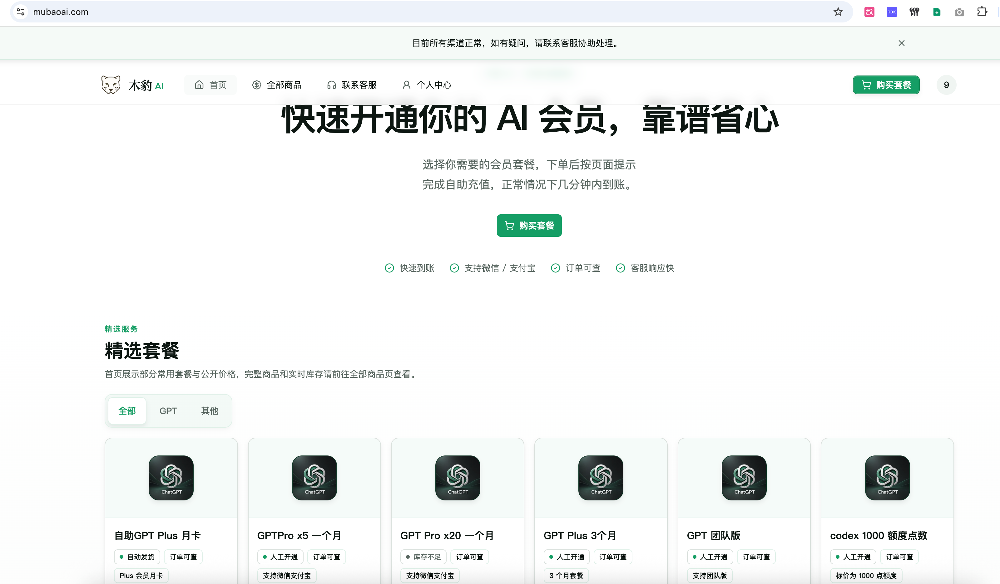
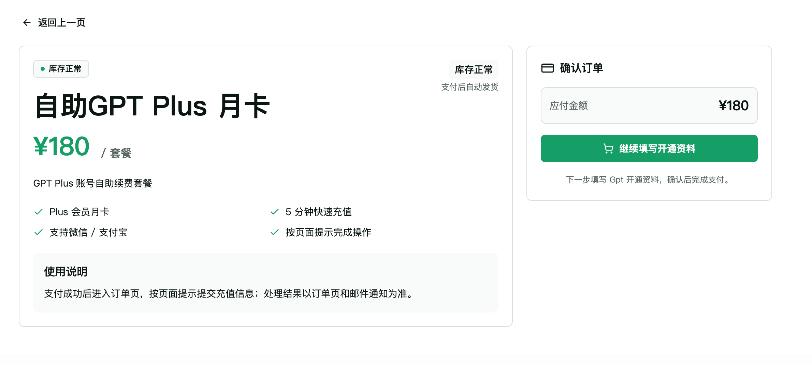
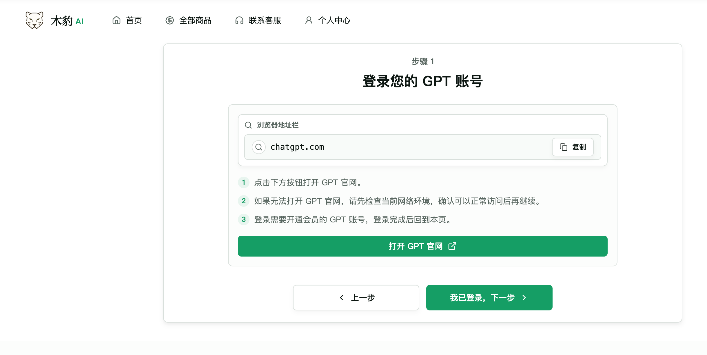
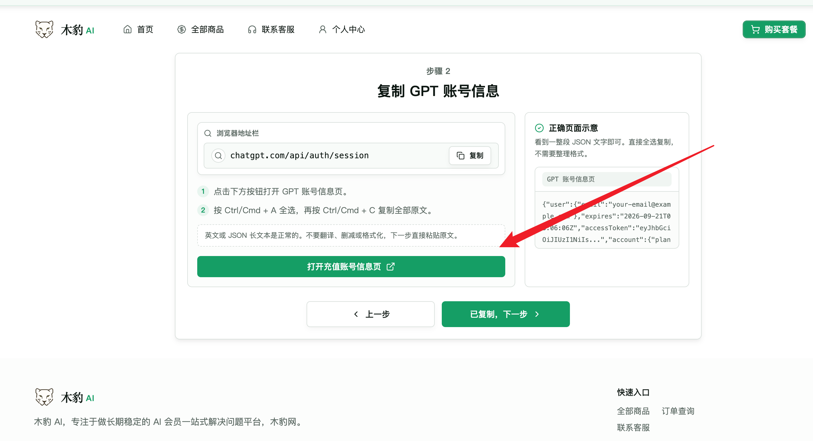
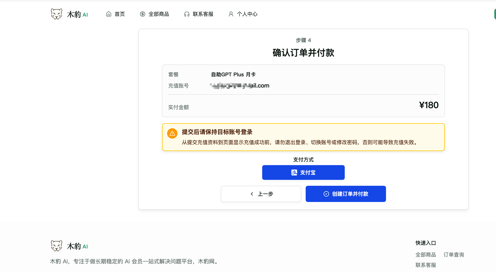
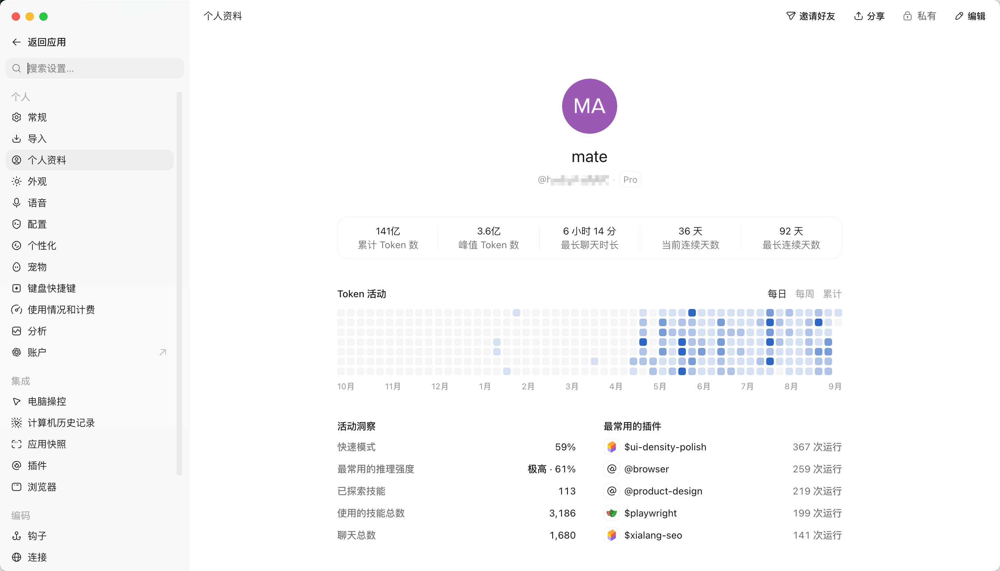

## 2026 年国内如何最稳定订阅 ChatGPT Plus Pro？已经稳定用了半年 PRO

> 更新日期：2026-09-14
>
> 适合人群：想开通 ChatGPT Plus，但没有海外卡、支付失败、找不到稳定渠道的用户

国内目前订阅 ChatGPT Plus PRO 的方法有很多，但是稳定是很重要的，这边给大家推荐几个长期稳定可以用的渠道分享。
你看完之后，大概就能判断自己适合官方充值、移动端订阅，

先说结论：

- 有海外信用卡，优先官方充值；
- 有美区 Apple ID，可以考虑 App Store 订阅；
- 熟悉 Google Play，可以走安卓订阅；
- 没有海外支付条件，又想省事，优先找靠谱稳定的自助充值平台。
- 不建议为了便宜买来源不明的共享账号，或者完全低于市场价格的渠道，成本跟账号都很重要。

## 自助充值流程

自助充值我们主要使用木豹 AI：https://mubaoai.com/

1.打开站点

首先我们打开木豹AI直接选择自己需要的套餐，比如以 Plus 为例子。

选择自助 Plus 月卡，他会提示我们继续填写开通资料。

按照他们的步骤进入第一步登录你自己的 ChatGPT 账号，检查账号是否有登录，如果是有登录的话，我们接下家来进入第二步。

注意，这里必须要先登录，如果是没有登录的话，复制出来提交到资料信息里面是不会有自己需要充值的 ChatGPT账号信息的。

接下来进入第二步，点击打开账号充值页面，打开后会拿到一大段乱码一样的东西，我们把这个所有的代码给他复制下来。

代码示意图

将这个所有的代码复制进来后，我们进入第三步，粘贴这个代码，然后确认一下自己需要充值的账号是否正确，如果是没有问题就进入下一步第四步。

粘贴识别充值到的邮箱确认无误之后，我们进入第四步，第四步这里，可以看到我们需要充值的邮箱跟订单信息，确认无误后，创建选择支付宝支付付款即可。

如果是选择自助 Plus 月卡，基本上 5 分钟内就会到账，到账的速度还是非常快速的，因为这个的确是很稳定靠谱的一个方式。

比如我自己用这个渠道开的ChatGPT PRO 会员，也就是最高档 200 美元X20 的那个套餐，也已经是开了半年多了，一直很稳定的。

木豹 AI 这个自助充值的站点可以很稳定的确认一件事情就是，是正规稳定付款，主要做长期的，如果是你比较珍惜账号，木豹这个是最优解。接下来回答一些常见的问题同步给大家。

### GPT 更新后还能不能充值？

最新消息自 2026 年 9 月 10 日起，ChatGPT Pro 每月 200 美元档，也就是 GPT Pro 20x，暂停接受新订阅和升级。现有 200 美元订阅仍照常续费，100 美元档的新购和已有订阅不受影响。[OpenAI 官方 Pro 套餐说明](https://help.openai.com/en/articles/9793128-what-is-chatgpt-pro/)

持续复测记录：

- **2026 年 9 月 10 日**：GPT 负责人 [Tibo](https://x.com/thsottiaux/status/2098113585683808624) 说明，

  > “We are going to pause subscriptions to our $200 Pro plan. These put the most strain on our systems.”

  他的完整意思是：为了保证现有用户的体验以及继续使用 Astra，OpenAI 暂停 **$200 Pro** 的新订阅；这个档位给系统带来的压力最大。其他套餐和 API 仍然开放，**现有 $200 Pro 账户不受影响**，OpenAI 正在尽快增加容量 。测试下来木豹 AI PRO X5 可开通 x20 暂时无法购买。

- **2026 年 9 月 8 日**：GPT-6 Astra 发布后更新模型说明，目前部分账号灰度推送GPT-6，充值方案依旧可使用。

- **2026 年 7 月 9 日**：GPT-5.6 Sol、Terra、Luna 发布后复测，方案仍可用。

- **2026 年 6 月 25—30 日**：2026 年 6 月 25 日 OpenAI 少量用户的订阅被系统错误取消，木豹 AI 订阅的所有会员全都正常。

- **2026 年 6 月 11 日**：ChatGPT 调整土耳其区 iOS 定价，方案依旧可用。

## 为什么国内用户开通 Plus 经常失败？

很多人不是不会操作，而是卡在付款。

常见情况大概有这些：

- 银行卡绑定失败；
- 页面提示 `Card declined`；
- 国内 Visa 或 Mastercard 还是付不了；
- 账单地址不匹配；
- App Store 或 Google Play 地区不对；
- 虚拟卡被拒；
- 低价渠道充值后掉会员。

这些问题很烦，但也挺常见。

ChatGPT Plus 的支付体系主要面向国际支付环境。
国内用户如果没有合适的海外卡，直接在官网订阅确实容易失败。

所以不要一失败就反复点付款。
如果同一张卡连续失败，建议先停一下，换一种方式会更稳。

如果是 VISA 付款失败，建议可以看下其他的一些支付渠道方式，不用死磕一个渠道。

## 方式一：官方海外卡订阅

如果你有可用的海外信用卡，这是最推荐的方式。

常见可用卡包括：

- Visa；
- Mastercard；
- American Express。

官方订阅的好处很明显：

- 账号安全性高；
- 订阅记录清楚；
- 后续续费方便；
- 不需要经过第三方。

但问题也很现实：

- 国内大部分卡不一定能用；
- 双币卡也可能被拒；
- 账单地址、卡段、地区都可能触发风控；
- 对新手来说不算省心。

所以，如果你已经有海外卡，可以先试官方。
如果没有，就不用为了开个 Plus 专门折腾很久。

如果你的确是很想折腾自己开 Plus，可能还需要护照跟办理 VISA 信用卡，如果是年纪低于 24 岁的不建议折腾这个渠道，申请海外的 VISA 通过了，OpenAI 也是会拒付的，我们这个是测试过的，香港卡也不行，基本都需要外卡的。

## 方式二：Apple ID 或 Google Play 订阅

手机用户可以考虑从 App 端订阅。

iPhone 用户一般会想到 Apple ID。
如果你有合适地区的 Apple ID，并且能买到可靠的礼品卡，
这条路是可以走的。

安卓用户可以考虑 Google Play。

但它同样需要处理账号地区、支付方式和网络环境。

这两种方式的优点是正规，缺点是准备工作比较多，比如需要先安装谷歌框架，或者必须要有一个 appstore 外区账号，特别是目前部分手机是安装不了 Google Pay 的，而且新手如果不会使用谷歌账号，可能绕一圈回来，会发现，谷歌账号会因为网络问题导致很容易被封号的。

适合这类用户：

- 本来就有美区或其他可用地区账号；
- 熟悉礼品卡充值；
- 不介意处理地区和支付设置；
- 希望订阅记录在 Apple 或 Google 账户里。

如果你完全没接触过这些账号体系，可能会觉得麻烦。

## 方式三：虚拟信用卡

虚拟信用卡以前挺多人用。

大概流程是：开一张虚拟 Visa 或 Mastercard，充值美元，
再拿去绑定 ChatGPT Plus。

听起来简单，但现在不太建议新手优先选它。

主要原因是：

- 虚拟卡平台质量参差不齐；
- 有些卡段容易被拒；
- 充值、换汇、提现都有成本；
- 卡被冻结后处理麻烦；
- 反复支付失败可能影响账号环境。

如果你熟悉虚拟卡和外币支付，可以把它当备用方案。

如果你只是想开通一个 Plus，没必要为了它研究一整套虚拟卡流程。

对于中国用户而言，办理开通一个海外信用卡是必须要使用到护照的，而且香港的信用卡也是付不了直接的ChatGPT，香港的信用卡也是会被拒付。

## 几种方式怎么选？

可以直接看下面这张表。

<!-- markdownlint-disable MD013 -->

| 方式 | 推荐指数 | 适合谁 | 难度 | 结论 |
| --- | --- | --- | --- | --- |
| 官方海外信用卡 | ★★★★★ | 有真实海外卡、长期使用 ChatGPT 的人 | 高 | 最稳，也最正规。但大多数国内用户没有合适的海外卡。 |
| 国内 Visa / Mastercard 双币卡 | ★★★☆☆ | 想先自己尝试官方订阅的人 | 中高 | 可以试，但不保证成功。常见问题是卡被拒、账单地址不匹配或银行风控。 |
| Apple ID / Google Play | ★★★☆☆ | 有可用地区 Apple 或 Google 账号的人 | 中高 | 正规，但账号地区、礼品卡和付款方式都要匹配，新手可能会卡住。 |
| 虚拟信用卡 VCC | ★★☆☆☆ | 熟悉虚拟卡、外币充值和账单地址的人 | 高 | 能作为备用方案，但现在风控较多，不建议新手优先使用。 |
| 加密卡 / 钱包类虚拟卡 | ★★☆☆☆ | 会使用 USDT、USDC，并能完成 KYC 的用户 | 中 | 适合有加密资产经验的人。新手要先看清平台地区、手续费和风控规则。 |
| 木豹 AI | ★★★★☆ | 想用国内支付方式快速完成订阅的人 | 低 | 简单快速可以几分钟搞定，木豹 AI 我自己测试过半年多很稳定了。 |

<!-- markdownlint-enable MD013 -->

如果你追求最稳，官方渠道优先。

如果你只是临时体验，建议先注册免费账号使用看下，如果是遇到额度不够用，或者免费账号不够用的情况下，再建议考虑去开通会员。

## 常见问题

### 国内银行卡一定不能用吗？

不是一定不能用。

有些卡可以成功，但很多国内用户会遇到付款失败。

如果你已经失败好几次，就建议换方案。

### 木豹 AI 充值跟官方充值有什么区别？

木豹 AI 主要是做长期的充值的，就是专门为解决那些无法充值 ChatGPT 的用户提供的一个充值渠道，会收取一些手续费，但是也是在合理的范围区间，这个也是他们主要做长期稳定渠道。

如果是开通 ChatGPT PRO 这种大金额的，尽量选有保障的平台，木豹 AI 就是主打长期稳定，木豹的客服响应速度也很快再工作时间基本秒回的。

## 总结

国内订阅 ChatGPT Plus，最麻烦的地方通常不是注册账号，而是支付方式。

有海外卡就走官方。
有成熟的 Apple 或 Google 环境，也可以走移动端订阅。
如果这些都没有，又不想折腾，建议找个靠谱的代充渠道吧。

最后再提醒一句：

不要只看便宜。

对普通用户来说，能稳定到账、有订单记录、出问题有人处理，
比便宜几十块更重要。
